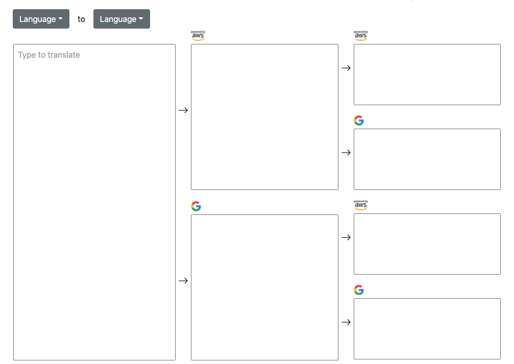

<p align="center"></p>

<h1 align="center">Retranslate</h1>

<p align="center">Retranslate text with <a href="https://cloud.google.com/translate">Google Translation</a> and <a href="https://aws.amazon.com/jp/translate/">Amazon Translate</a>.</p>

<p align="center">
<a target="_blank" rel="noopener noreferrer" href="https://camo.githubusercontent.com/a568b3692dcc72af17d4abfed1b2c81d47f05dcaaefb021c9f9d3d6a856d3e6e/68747470733a2f2f696d672e736869656c64732e696f2f62616467652f4c6963656e73652d4d49542d696e666f726d6174696f6e616c3f7374796c653d666c6174"></a><!--&nbsp;
     -->
</p>
<!--
<p align="center">
    <a href="https://retranslate-demo.herokuapp.com/"><strong>Demo</strong></a>
</p>
-->
<br>

## Table of Contents

- [Features](#features)
- [Usage](#usage)
- [Development](#development)
- [License](#license)

## Features

- Translate text with Google Translation API and Amazon Translate API.
- Translate translated text again.

## Usage

<p align="center"></p>

Select a source language and enter text, and this app will translate them after a while.

## Development

### Tech stacks

- TypeScript, Node.js
- React, Next.js
- gRPC WEB

### Setup

#### Requirements

- macOS 10.15.5
- [Node.js](https://nodejs.org/en/) v14.15.3, npm 6.14.9

We tested in the above environment.

#### Install npm modules

```sh
$ npm install
```

#### Set environment variables

Set environment variables. For details, to see [.env.example](.env.example).

### npm commands

| Command    | details                                    |
| ---------- | ------------------------------------------ |
| dev        | Run on development mode                    |
| build      | Build app for production                   |
| start      | Run on production mode                     |
| type-check | `tsc` checks .ts types                     |
| format     | Format codes                               |
| lint       | Lint codes                                 |
| test       | Run lint, type-check, test-snap, and tests |
| test-snap  | Update jest snapshots                      |

### Structure

- This app is constructed on Next.js.
- Use [Translation gRPC API](https://github.com/takakd/translation-api) to translate text.

#### Sources

```sh
.
|-- .env.local          <-- Environment variables on local
|-- .github             <-- Deployment GitHub action
|-- README.next.md          <-- Next.js readme
|
|-- api                     <-- API classes
|   `-- translator.ts
|
|-- components                  <-- React components
|   |-- github-corner.tsx       <-- Google Analytics Tag
|   |-- google-analytics.tsx    <-- GitHub corner icon
|   |-- lang-select.tsx         <-- Language selection dropdown
|   |-- service-image.tsx       <-- Translation service image
|   `-- text-box.tsx            <-- Text box
|
|-- grpc                    <-- Auto generated gRPC classes
|-- next-env.d.ts           <-- Ensuring Next.js types for TypeScript
|-- pages           <-- Next.js pages
|   |-- _app.tsx
|   `-- index.tsx   <-- Home page
|
|-- public          <-- Logo images
|   |-- favicon.png
|   |-- logo-aws.png
|   `-- logo-google.png
|
|-- scripts
|   `-- proto      <-- Script to generate gRPC classes with .proto
|
|-- static.json     <-- heroku-buildpack-static config to deploy to Heroku
|
`-- test        <-- jest tests files
```

### proto

This app uses [Translation gRPC API](https://github.com/takakd/translation-api) and needs JavaScript codes generated by proto definitions.
Generate codes by the below commands:

```sh
$ ./scripts/proto /Somewhere/api/protos
```

## Get in touch

- [Dev.to](https://dev.to/takakd)

## Contributing

Issues and reviews are welcome. Don't hesitate to create issues and PR.

## License

&copy; 2021 takakd
